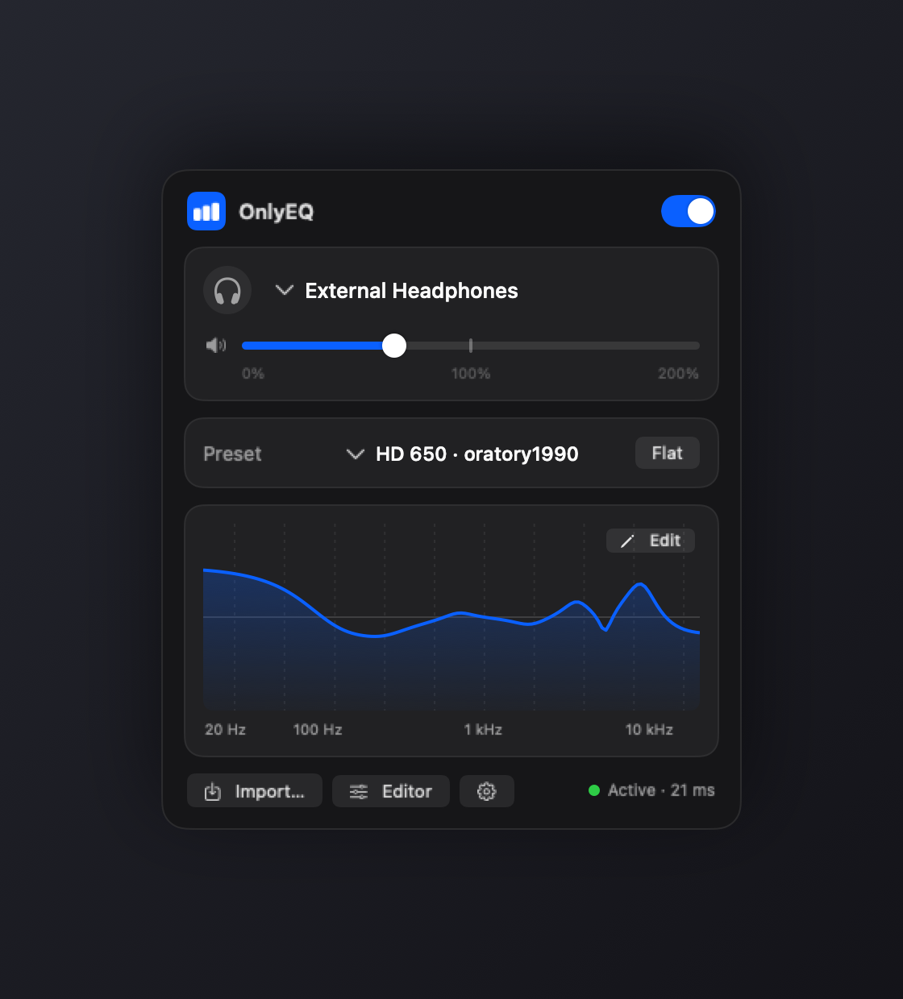
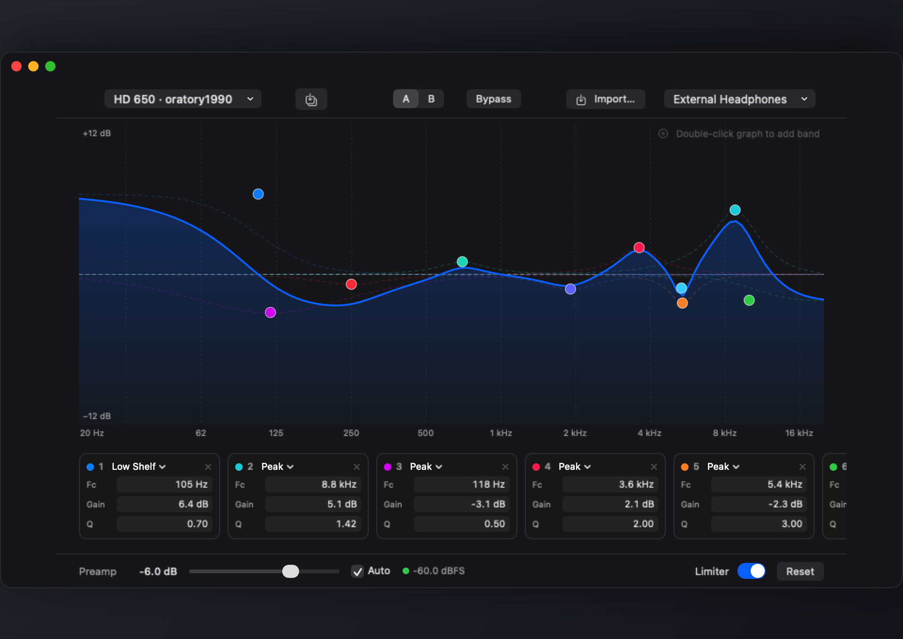
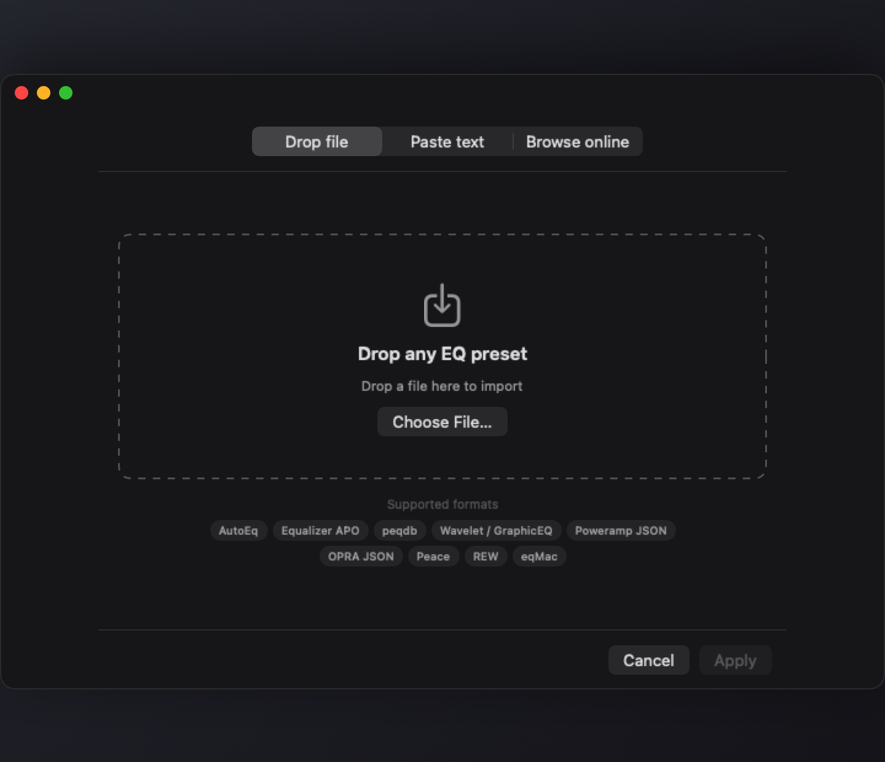

<p align="center">
  
</p>

# OnlyEQ

System-wide parametric EQ for macOS. Lives in the menu bar. No virtual audio drivers.

Every Mac EQ I tried either made me install BlackHole or a HAL driver, charged for parametric bands, or buried a simple job under a complicated UI. OnlyEQ instead uses the process tap API Apple added in macOS 14.4: it taps the system output mix, runs it through biquad filters, and plays the result back to your output device. Nothing to install, no password, no coreaudiod restarts, and your volume keys keep working. Adds roughly 20 ms of latency.

## Install

```sh
curl -fsSL https://raw.githubusercontent.com/zollans/OnlyEQ/main/scripts/install.sh | bash
```

The app isn't notarized (there's no paid developer account behind this), so the script clears the quarantine flag after downloading — [read it first](scripts/install.sh) if that concerns you. Or build from source, it takes about a minute and only needs the Xcode Command Line Tools:

```sh
git clone https://github.com/zollans/OnlyEQ && cd OnlyEQ
./scripts/build-app.sh && cp -R build/OnlyEQ.app /Applications/
```

Requires macOS 14.4 or newer. On first launch it asks for System Audio Recording permission — that's the tap. macOS shows the purple recording indicator while EQ is active; audio never leaves your machine.

## What it does

<p align="center">
  
</p>

- Parametric EQ with a draggable curve editor. Peak, shelves, high/low pass, notch, band pass — as many bands as you want.
- Imports every headphone EQ format I could find: AutoEq, Equalizer APO, peqdb, Wavelet/GraphicEQ, Poweramp, OPRA, Peace, REW, eqMac. Drop a file, paste text, or search the peqdb and AutoEq databases from inside the app.
- Per-device profiles. Your headphone preset kicks in when the headphones connect; your speakers keep theirs.
- Volume boost up to 200%, automatic preamp so boosted EQ doesn't clip, a limiter as a safety net, A/B compare, one-click bypass.
- An exclude list for apps that handle their own audio (DAWs, Zoom).
- Global hotkeys for toggling EQ and cycling output devices. Launch at login. That's it — one popover, one editor window, one settings window.

<p align="center">
  
</p>

## How it works

A muted global process tap silences the original system output; the tap and the real output device get wrapped in a private aggregate device; an IO callback reads the tapped audio, runs it through RBJ cookbook biquads (plus preamp and a stereo-linked limiter), and writes it to the device. Filter changes swap in atomically without touching the audio thread.

This is the same approach the newer generation of Mac audio tools moved to after macOS 14.4, and it kills the classic virtual-driver failure modes: Bluetooth devices distorting until reconnect, sample-rate mismatches, apps escaping the EQ because they pin their output device, and the driver breaking on every macOS update.

Trade-offs, honestly: the purple recording dot is always on while EQ runs, macOS below 14.4 isn't supported, and pro-audio apps doing their own low-level routing can misbehave with taps — that's what the exclude list is for.

## Development

Plain SwiftPM, no Xcode project, no dependencies:

```sh
swift run OnlyEQ --test               # self-test suite (importer + DSP)
swift run OnlyEQ --engine-probe       # headless engine check, prints JSON
swift run OnlyEQ --screenshots out/   # renders the README screenshots
./scripts/build-app.sh release        # universal binary release build
```

Tests run inside the binary because the Command Line Tools don't ship XCTest. Diagnostics land in `~/Library/Logs/OnlyEQ.log`.

Free, no license, do whatever you want with it.
